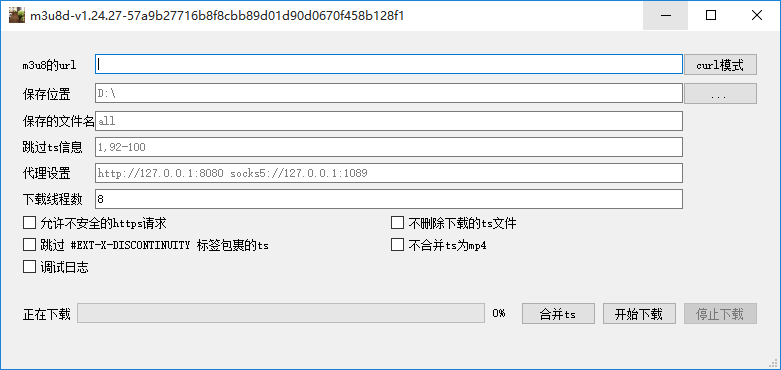

## m3u8 Video Download Tool
* No ffmpeg dependency, no additional environment configuration required
* Provides Windows GUI (Qt), Mac/Linux command line, Linux supports ARM, 386, MIPSLE
* Automatically merges downloaded TS files and converts them to MP4 format
* 
* [Download all versions](https://github.com/orestonce/m3u8d/releases), including Windows GUI/Linux CLI/Mac CLI/Mac GUI
* Command Line Usage
  * Basic download command: `./m3u8d download -u https://example.com/index.m3u8`
  * Curl mode: `./m3u8d curl 'https://example.com/index.m3u8' -H 'cookie: CONSENT=YES'`
  * Merge TS files in a directory to MP4: `./m3u8d merge --InputTsDir /root/save --OutputMp4Name save.mp4`
## Implementation Details
* download.go mostly copied from [llychao/m3u8-downloader](https://github.com/llychao/m3u8-downloader)
* Uses [gomedia](https://github.com/yapingcat/gomedia) instead of ffmpeg for format conversion
* Supports skipping TS files
* Program creates in download directory:
    * downloading/ directory for storing in-progress TS segments, organized by m3u8 URL
    * m3u8d_config.json file for storing Qt UI configuration (only for Windows/Mac Qt versions)
* **Curl Mode** allows setting custom request headers, useful for downloading protected videos
  * Example 1: Downloading videos that require login (cookies contain login state)
  * Example 2: Websites that validate Referer, Authority, Origin, User-Agent, and other specific headers
  * For Windows Chrome: Find the m3u8 request, right-click "Copy - Copy as cURL(bash)", then paste into Windows Qt version's "curl mode"
* Feature List
  * Automatically detects and downloads m3u8 links from HTML if URL doesn't appear to be m3u8
  * Supports AES encrypted m3u8, including different encryption strategies for different TS files
  * Multi-threaded TS file downloading
  * TS to MP4 conversion supported on Windows, Linux, Mac
  * After thorough testing, uses [gomedia](https://github.com/yapingcat/gomedia) instead of ffmpeg
  * Added MIPSLE binary for OpenWRT routers
  * Supports parsing curl commands for download info, similar to [cxjava/m3u8-downloader](https://github.com/cxjava/m3u8-downloader)
  * Displays download speed and TS merge speed
  * Provides MacOS GUI
  * Supports nested m3u8 URLs
  * TS file merge optimization
    * TS files may have different resolutions/FPS (e.g., first file 1920x1080, second 800x600)
    * Current solution: Analyze first TS file's resolution/FPS, skip merging if subsequent files differ
  * Supports proxy settings: HTTP/SOCKS5
    * HTTP proxy explanation: Visible GET/POST/HEAD for HTTP, CONNECT for HTTPS
  * TS skip expressions use comma ',' separator:
    * TS files numbered starting from 1
    * Skip TS #10: 10
    * Skip TS #23 to #199: 23-199
    * Skip TS with HTTP status codes: http.code=403, http.code=404
    * HTTP status code skipping may cause errors, so by default doesn't merge or delete skipped TS
      * To merge skipped TS: if-http.code-merge_ts
## TODO:
  * [ ] Adaptive multi-threading for optimal download speed
  * [ ] Multi-language support
  * [ ] Batch download from text file
## Development Guide:
* For CLI version: Modify *.go files and compile cmd/main.go
* For Qt GUI: Run export/main.go to generate Qt files:
  `m3u8-qt/m3u8.h`, `m3u8-qt/m3u8.cpp`, `m3u8-qt/m3u8-impl.a`, then package with QtCreator
## License
* m3u8d-qt/ directory released under [GPL v3](m3u8d-qt/LICENSE)
* All other code released under [MIT License](LICENSE)
## Development Support
 * Supported by JetBrains Open Source License ([Licenses for Open Source Development](https://jb.gg/OpenSourceSupport))
 * Thanks to [gomedia](https://github.com/yapingcat/gomedia) for TS to MP4 conversion
 * Thanks to [cobra](https://github.com/spf13/cobra) for CLI parsing
 * Thanks to [setft](https://github.com/xiaoqidun/setft) for file timestamp updates
----------------------------------
## Why Use gomedia Instead of ffmpeg
### Issues with ffmpeg:
1. ffmpeg's GPL license is viral, preventing MIT licensing for main project
2. Using cgo to call ffmpeg:
    * Increases binary size significantly
    * Requires cross-compilers for Mac/Linux/router versions
3. Embedding static ffmpeg binary:
    * Further increases binary size (see [v1.1](https://github.com/orestonce/m3u8d/releases/tag/v1.1), 25MB larger)
    * No static ffmpeg for MIPSLE routers
4. Calling ffmpeg command requires pre-installation, inconvenient
### Benefits of MIT-licensed gomedia:
1. Pure Go code, easy cross-compilation
2. Allows MIT licensing for project
3. Small binary size (5-7MB for Linux/Mac CLI, 26MB for Windows with Qt GUI)
4. No ffmpeg installation required, better user experience
